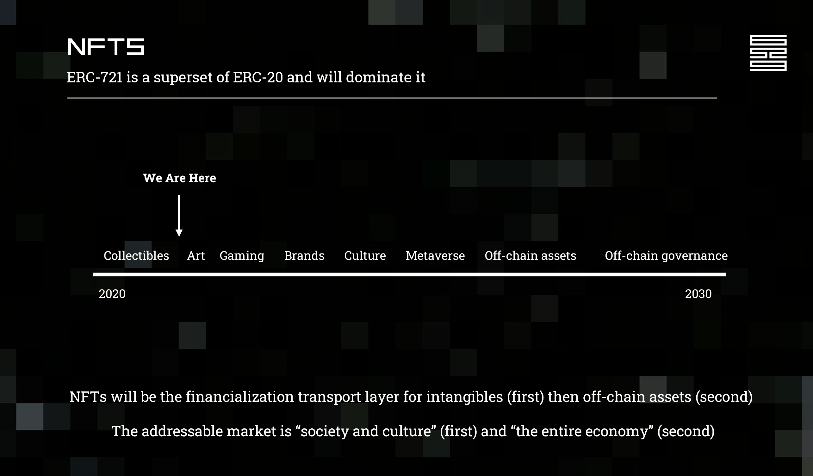

# 🎈 Will NFTs still be around in the future or the bubble will burst?


Contributors: [@paarugsethi](https://twitter.com/paarugsethi)


**NFTs are here to stay.**

While we did say that a lot of projects are most likely going to go to zero, the idea of Non-Fungible Tokens will be a part of our society as long as there is the internet.

[6529](https://twitter.com/punk6529) here gives a good picture of where we're at and where we're headed.

NFTs are going to change the way we transact intellectual property digitally as well as physically.

Authenticity and provable scarcity on-chain will make tokens the final stamps of approval. This is a cultural as well as technological shift enfolding in front of our eyes.

## Here's a video to get you going



## Here's an article for a complete deep dive



## You can't go long without Crypto Twitter



## FAQs

If you have any doubts related to this topic or you have a suggestion, feel free to create an issue [here](https://github.com/SuperteamDAO/ground-zero/issues).

If you want to make edits to this topic or update the topic, please click on the "Edit on Github" link you see on the right section, make the changes and create a pull request to the master branch. One of the moderators will look at your changes & merge your changes if all looks good.

And yes, if you update anything in this topic, don't forget to add your GitHub username in the contributors' list!

Have a happy learning! ✌️
